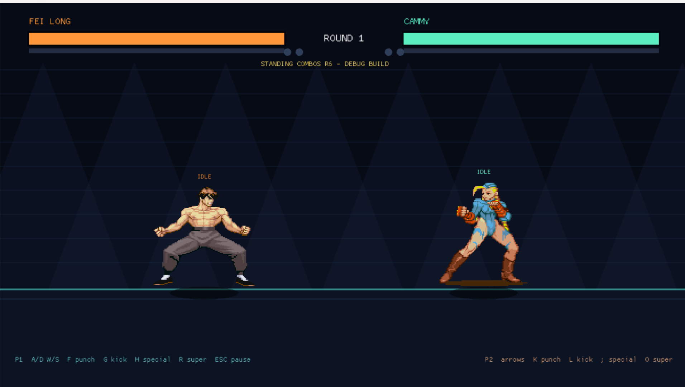

# 2D Fighter

A local, educational Rust + Macroquad fighting-game project for two players on one keyboard. It is not intended for public distribution.

## Software required

- Windows 10 or 11
- [Rust](https://www.rust-lang.org/tools/install) stable, installed through `rustup` (this includes Cargo)
- Visual Studio 2022 Build Tools with **Desktop development with C++** if the Microsoft C++ linker is not already installed
- An internet connection for the first build so Cargo can download Macroquad and its audio dependencies

VS Code is optional. Macroquad, Python, and a separate game engine do not need to be installed manually.

Confirm Rust is available from PowerShell:

```powershell
rustc --version
cargo --version
```

## How to run

Open PowerShell in the project folder:

```powershell
cd "C:\Users\OWNER\Documents\jinshi_projects\fighting-game\private-alpha-fighter-milestone-1"
cargo run
```

The first run takes longer because Cargo compiles the dependencies. Later runs reuse the compiled files under `target/`.

To verify the project without starting the game window:

```powershell
cargo test
cargo check
```

## Gameplay preview



## Controls

| Player | Move | Jump | Crouch | Punch | Kick | Special | Super |
| --- | --- | --- | --- | --- | --- | --- | --- |
| P1 | A / D | W | S | F | G | H | R |
| P2 | Left / Right | Up | Down | K | L | ; | O |

Press **Escape** during a match to pause. From the pause screen, press **Escape** to resume or **Enter** to return to character selection.

Hold **Down + Special** for the second special, or **toward opponent + Special** for the third. A full super meter is required for a super.
Unused super meter carries into the next round; beginning a new match resets it.

Directional attacks use the same buttons naturally:

- Tap neutral Punch up to three times: light -> medium -> heavy punch combo
- Tap neutral Kick up to three times: light -> medium -> heavy kick combo
- The next press can be buffered during the current attack or entered within 30 frames after it ends
- Toward + Punch/Kick: forward normal
- Away + Punch/Kick: heavy normal
- Down + Punch/Kick: crouching attack
- Down + Toward + Punch/Kick: alternate crouching attack
- Down + Away + Punch/Kick: crouching heavy attack
- Punch/Kick while airborne: jump attack
- Toward + Punch/Kick while airborne: forward jump attack
- Away + Punch/Kick while airborne: heavy jump attack
- Punch + Kick together: close throw
- Hold away while an attack or projectile approaches: block; add Down for crouch block
- Hold toward while jumping to pass over an opponent. Once the fighters cross, their positions and facing directions update automatically.


## Projectile counterplay

Dee Jay and Rose have projectile specials. Projectile artwork is deliberately larger than its collision box. Jumping early enough clears normal projectiles and can clear Rose's super near the jump apex; jumping late can still be caught. Holding away blocks an approaching projectile. Fei Long and Cammy instead rely on advancing and rising specials to close distance.

